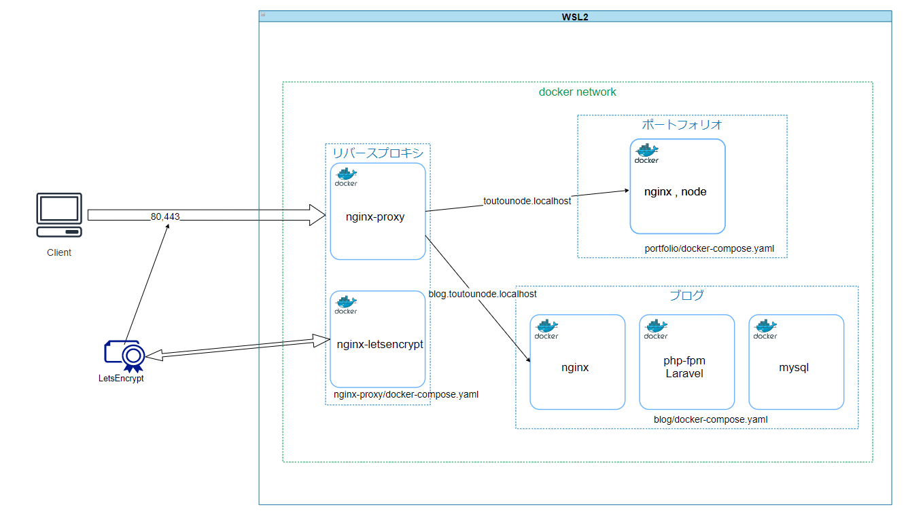

# toutou-node
[](https://github.com/Itu-tree/toutou-node/actions/workflows/test.yaml)
[](https://github.com/Itu-tree/toutou-node/actions/workflows/deploy.yml)

成果物を紹介したり、記事を書いたりする場所

# 全体構成



# 開発環境のセットアップ
## 開発環境
- [VSCode Remote Containers](https://code.visualstudio.com/docs/remote/containers)
    - windows(WSL2)
    - docker

## セットアップ
Ubuntuのコンソール
```
$ git clone https://github.com/Itu-tree/toutou-node.git
$ cd toutounode
$ make local-deploy
```

# メンテナンス

## npmの管理
### portofolioとblogのnginxのコンテナ

```
$ npm outdated
$ npm update
```

## CKEditor5の管理
https://zenn.dev/toutou/scraps/9460ae2702f810

## composerの管理

blog_phpコンテナ内で
```bash
/var/www/html $ composer update
```

# リモートサーバーにデプロイ
## コードのクローンとdockerのビルド、サーバーの立ち上げ
サーバーのコンソール
```
$ git clone https://github.com/Itu-tree/toutou-node.git
$ cd toutounode
$ make prod-deploy
```

## 管理者アカウントの作成
サーバーのコンソールからコンテナに入る
```
$ cd toutounode/blog
$ docker-compose exec php bash
```

コンテナ内で以下のコマンドを入力
```
# php artisan tinker
>>>　App\User::firstOrCreate(['name'=>'admin','email'=>'admin@gmail.com','password'=>Hash::make('password')])
```

